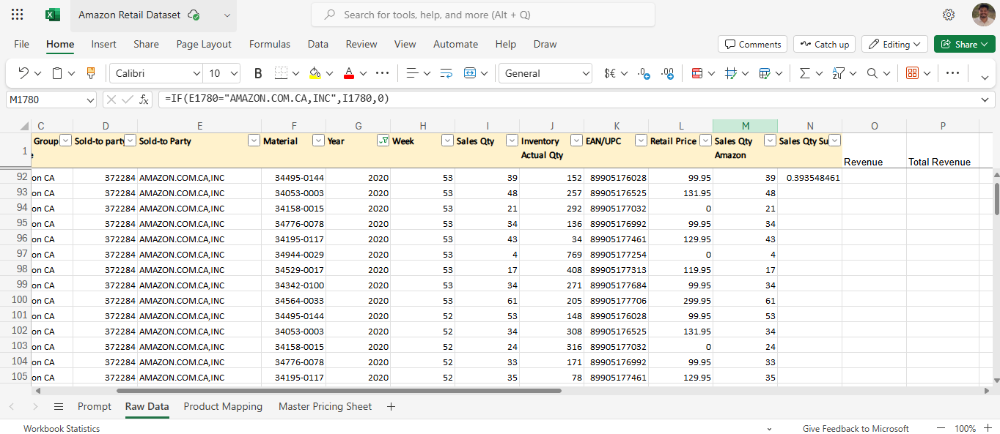
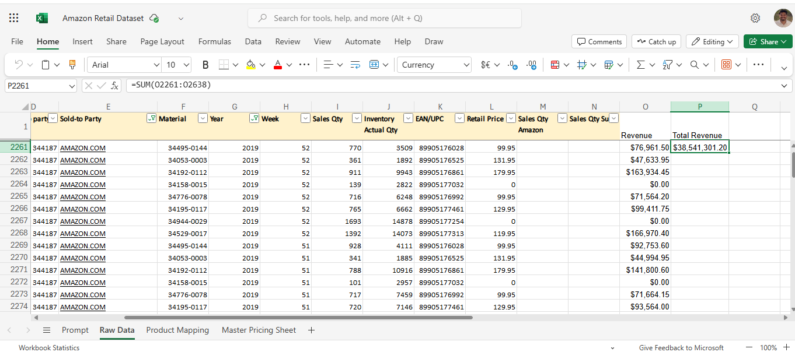

# Amazon Retail Sales Analysis

This project analyzes sales data from Amazon's retail operations to calculate the following metrics:

1. **What percentage of sales did AMAZON.COM.CA, INC have in 2020?**
2. **What was the revenue for Amazon.com in 2019?**

## Approach

### 1. Percentage of Sales by AMAZON.COM.CA, INC in 2020


Steps:
1. **Filter Data for 2020**  
   Filtered the "Raw Data" sheet to include only rows with the year 2020.
   
2. **Map Product Details**  
   - Added a new column by mapping **EAN/UPC** using the "Material Number" column from the **Product Mapping** sheet.  
   - Filled another new column with **Retail Price** by mapping the **EAN/UPC** column to the **Master Pricing Sheet**.

3. **Calculate AMAZON.COM.CA, INC Sales Quantity**  
   Created a new column using the formula:
   ```excel
   =IF(E92="AMAZON.COM.CA,INC",I92,0)
   ```
   - This captures the sales quantity for `AMAZON.COM.CA, INC`.

4. **Calculate Percentage of Sales**  
   Created another new column to calculate the percentage of sales using the formula:
   ```excel
   =(SUM(M92:M2260)/SUM(J92:J2260)) * 100
   ```
   - Where:
     - `M92:M2260` represents the sum of sales quantities for `AMAZON.COM.CA, INC`.
     - `J92:J2260` represents the total inventory actual quantity.

### 2. Revenue for Amazon.com in 2019


Steps:
1. **Filter Data for 2019**  
   Filtered the "Raw Data" sheet to include only rows with the year 2019 and **Sold-to Party = Amazon.com**.

2. **Sum Revenue**  
   Summed up the **Revenue** column for the filtered data to get the total revenue.

## Tools Used

- **Microsoft Excel:** For filtering data, mapping columns, and performing calculations using formulas.

## Results

1. **Percentage of Sales by AMAZON.COM.CA, INC in 2020:**  *0.39*  
2. **Revenue for Amazon.com in 2019:**  *38541301.2*  

## How to Reproduce

1. Open the provided dataset (`Amazon Retail Dataset.xlsx`).
2. Follow the steps outlined in the approach for each metric.
3. Use the formulas mentioned for calculations.

## Authors

- **Venkanna Chowdary Penubothu**
